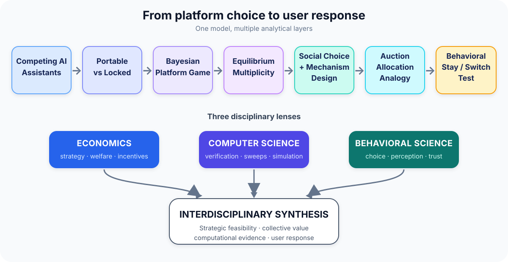
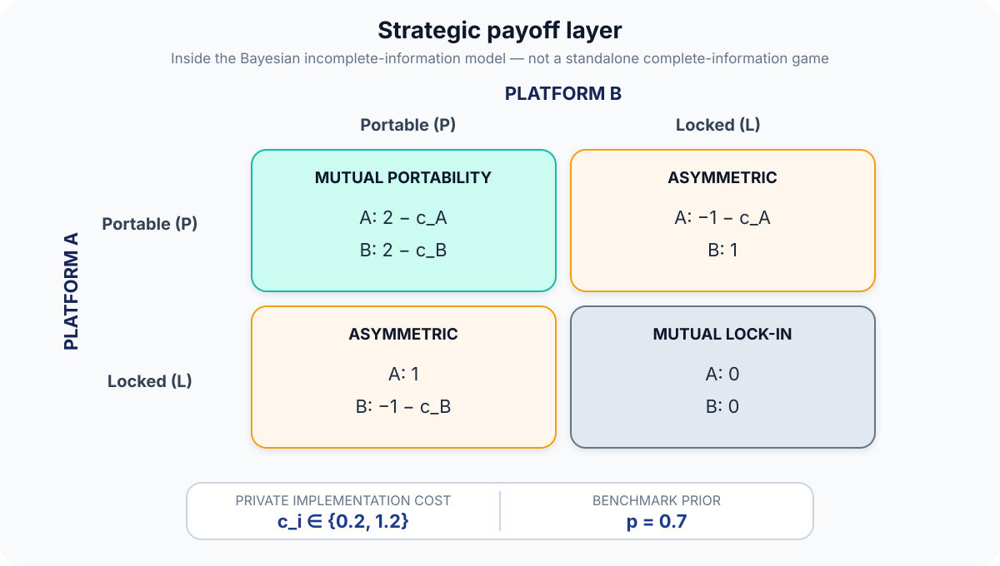
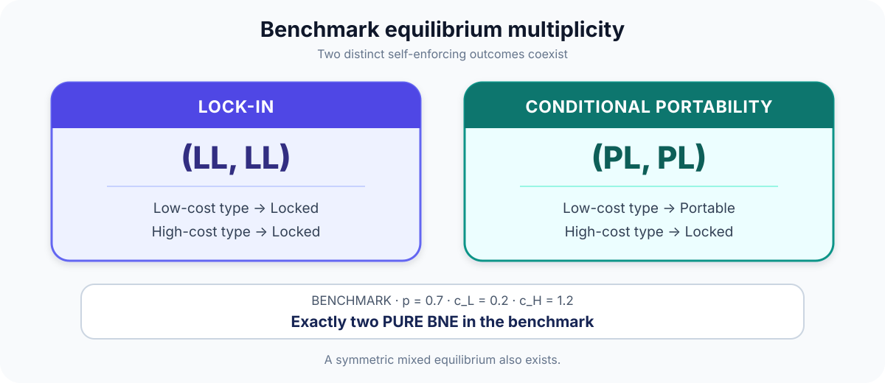
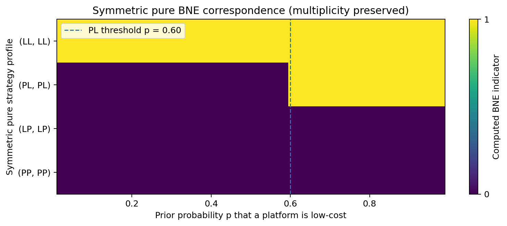
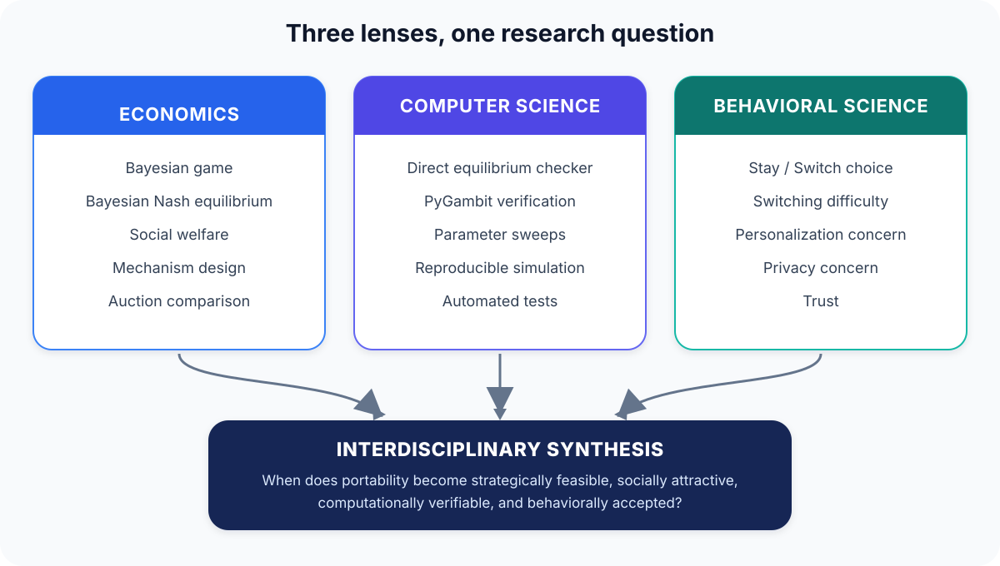
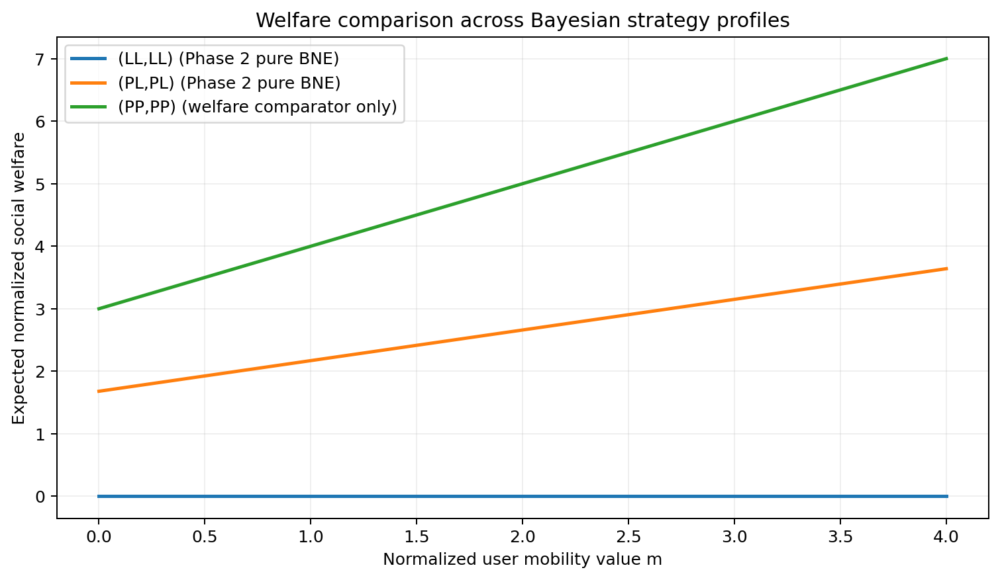
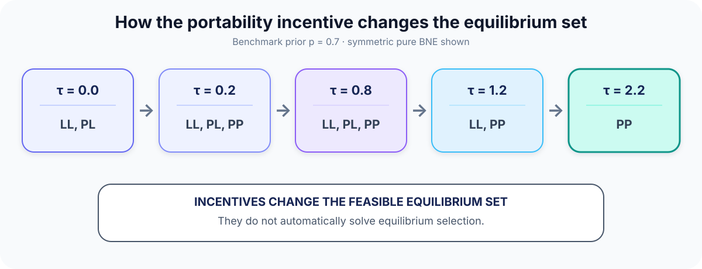
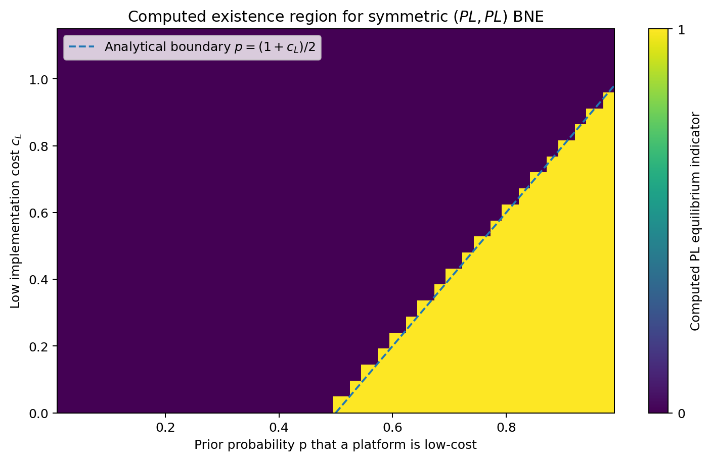
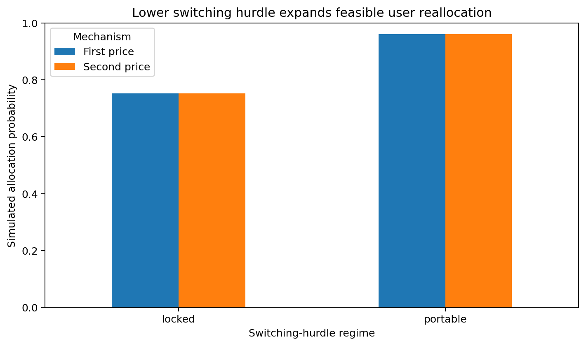
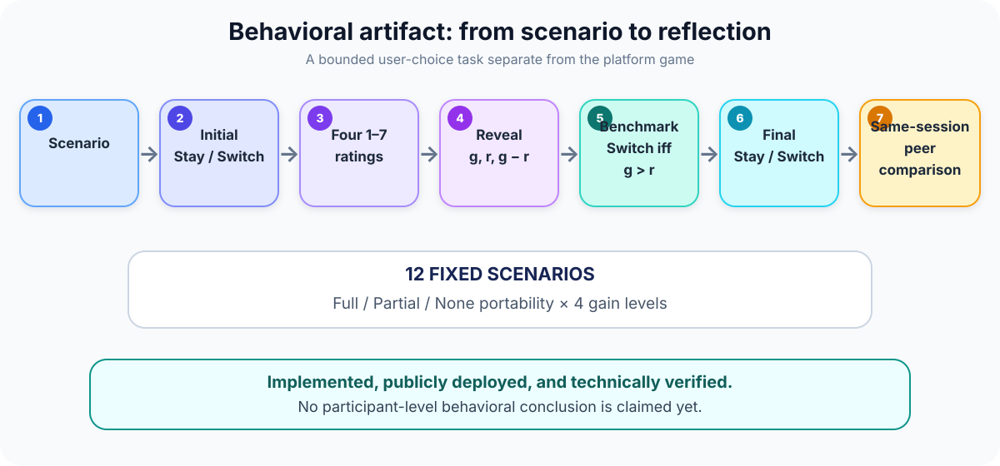

<div align="center">

<h1>Stay or Switch?</h1>

<h3>Strategic Memory Portability in Competing AI Assistants</h3>

<p>
  <strong>COMSCI/ECON 206 · Computational Microeconomics</strong><br>
  Duke Kunshan University · Autumn 2026<br>
  <strong>FP10 · Yiqiao Liu</strong>
</p>

<p><em>When competing AI assistants decide whether user memory should be portable, strategic incentives can sustain both lock-in and conditional portability.</em></p>

<p>
  <a href="submission/PS2-FP10-StayOrSwitch.pdf"></a>
  <a href="submission/PS2-FP10-StayOrSwitch-A0-Poster.pdf"></a>
  <a href="https://huggingface.co/spaces/mickeystk/ps2-stay-or-switch-memory-portability"></a>
</p>

<p>
  <a href="https://colab.research.google.com/github/dku-comsci-econ206-Autumn2026/FP10-StayOrSwitch-Yiqiao/blob/main/notebooks/01_memory_portability_bayesian_game.ipynb"></a>
  <a href="https://colab.research.google.com/github/dku-comsci-econ206-Autumn2026/FP10-StayOrSwitch-Yiqiao/blob/main/notebooks/02_social_choice_mechanism_auction.ipynb"></a>
  <a href="#reproducibility"></a>
</p>

</div>

<p align="center">
  
</p>

## Research question

AI assistants accumulate memory about users' preferences, projects, and interaction histories. Competing platforms can either make that memory **Portable (`P`)** or keep it **Locked (`L`)**.

> **When do competing AI assistants voluntarily make memory portable, when does strategic lock-in persist, and how do welfare, incentive design, allocation, and user behavior change the picture?**

## Strategic model

Two platforms—A and B—simultaneously decide whether user memory can move to a rival. Each company privately learns whether portability would be inexpensive or costly for it.

<p align="center">
  
</p>

**What the four situations mean:**

- **Mutual portability:** both platforms open memory, and each receives the cooperation benefit minus its own implementation cost.
- **One portable, one locked:** the open platform bears the cost and is strategically disadvantaged; the locked platform benefits from the asymmetry.
- **Mutual lock-in:** neither platform opens memory, so both receive the normalized baseline payoff.

Each platform's private cost is either low or high:

| Parameter | Meaning | Benchmark |
|---|---|---:|
| `p` | Probability that a platform has low cost | `0.7` |
| `c_L` | Low portability cost | `0.2` |
| `c_H` | High portability cost | `1.2` |

Because a company must plan for either possible cost, its strategy specifies an action for **both** types:

| Strategy | Low-cost type | High-cost type |
|:---:|---|---|
| `LL` | Locked | Locked |
| `PL` | Portable | Locked |
| `LP` | Locked | Portable |
| `PP` | Portable | Portable |

If `q` is the probability that the rival chooses Portable and `c` is this platform's private cost:

- **Portable expected payoff:** `3q − 1 − c`
- **Locked expected payoff:** `q`

The compact decision rule is `Portable when 2q − 1 − c ≥ 0`.

**What this means:** a platform opens memory only when the competitive benefit of portability is large enough to cover its private implementation cost.

### Benchmark equilibria

<p align="center">
  
</p>

At the benchmark, the model has exactly two **pure** Bayesian Nash equilibria:

- **`(LL, LL)` — lock-in:** both low- and high-cost types of both platforms keep memory locked.
- **`(PL, PL)` — conditional portability:** each low-cost type opens memory, while each high-cost type remains locked.

**What this means:** the same market can support two self-consistent outcomes. Neither platform can profitably change alone in its respective pure equilibrium. These are not the only equilibria overall—a symmetric mixed equilibrium also exists.

<p align="center">
  
</p>

<p align="center"><em>As beliefs change, the set of sustainable pure outcomes changes; the computation preserves multiplicity rather than imposing an equilibrium-selection rule.</em></p>

## Three analytical lenses

<p align="center">
  
</p>

- **Economics** identifies incentives, equilibria, welfare comparisons, mechanism effects, and the allocation analogy.
- **Computer science** implements the model, checks equilibria directly and with PyGambit, runs parameter sweeps and simulations, and tests the results.
- **Behavioral science** asks how people respond to switching difficulty, personalization, privacy, and trust.

**What this means:** strategic feasibility, modeled collective value, computational verification, and user acceptance are different kinds of evidence. One cannot substitute for another.

## Social choice

**Question:** What outcome would look preferable if we also count the modeled value users receive from moving their memory?

- `LL`: both platforms remain locked.
- `PL`: only low-cost platform types provide portability.
- `PP`: both cost types provide portability.

Let `m` denote the modeled user benefit from mutual portability.

| Outcome | Normalized collective objective |
|:---:|---:|
| `LL` | `0` |
| `PL` | `1.68 + 0.49m` |
| `PP` | `3 + m` |

For the implemented range `m = 0` to `4`, the ranking is `PP > PL > LL`.

<p align="center">
  
</p>

**What this means:** mutual portability ranks highest under this stated normalized objective. This is not a universal welfare conclusion: the comparison omits richer consumer differences and real privacy, security, and market effects.

## Mechanism design

**Question:** What if policy or platform design gives firms an extra benefit for verified portability?

Let `τ` denote that portability incentive. As it increases, additional portable equilibria can become feasible.

<p align="center">
  
</p>

| Incentive `τ` | Pure equilibrium set |
|---:|---|
| `0.0` | `LL`, `PL` |
| `0.2` | `LL`, `PL`, `PP` |
| `0.8` | `LL`, `PL`, `PP` |
| `1.2` | `LL`, `PP` |
| `2.2` | `PP` |

> **Key insight:** Changing incentives is not the same as solving equilibrium selection.

With the incentive, the compact decision rule becomes `Portable when 2q − 1 − c + τ ≥ 0`, where `q` is the chance the rival is portable, `c` is this platform's private cost, and `τ` is the portability incentive.

**What this means:** a moderate incentive can make open outcomes strategically feasible without automatically removing lock-in. Only the largest illustrated incentive makes `PP` the unique pure equilibrium in the verified benchmark sweep. No welfare-optimal incentive is claimed because financing and mechanism costs are not modeled.

<p align="center">
  
</p>

## Auction application

> **This is an allocation analogy, not a literal auction of users.**

Imagine one user's next-period primary AI-assistant slot as the scarce resource. Portability lowers the modeled switching hurdle, making competitive reassignment easier.

| Portability regime | Switching hurdle `r` | Simulated allocation probability |
|---|---:|---:|
| Locked | `0.50` | `0.75193` (about `75%`) |
| Portable | `0.20` | `0.96004` (about `96%`) |

The simulation uses `100,000` common valuation draws and seed `20603`.

<p align="center">
  
</p>

**What this means:** lowering the switching hurdle raises the probability that the slot can be competitively allocated from about 75% to about 96%. These normalized magnitudes are not estimates of real AI markets.

## Behavioral artifact

<p align="center">
  <a href="https://huggingface.co/spaces/mickeystk/ps2-stay-or-switch-memory-portability"></a>
</p>

<p align="center">
  
</p>

The artifact follows a simple user journey: see a scenario, choose Stay or Switch, reflect on four 1–7 ratings, see the benchmark, choose again, and optionally compare with earlier plays from the same browser session.

Here, `g` is the gain from switching and `r` is the switching hurdle. The benchmark says: **Switch when `g > r`.**

| Portability condition | Switching hurdle `r` |
|---|---:|
| Full portability | `0.20` |
| Partial portability | `0.35` |
| No portability | `0.50` |

The 12 fixed scenarios cross these three conditions with four gain levels. The static deployment stores no persistent participant data; peer summaries reset with the browser page session.

> **Evidence status:** Implemented, publicly deployed, and technically verified; no participant-level behavioral conclusion is claimed yet.

## Computational verification

| Component | Verification |
|---|---|
| Bayesian game | Direct type-level checker + PyGambit cross-check |
| Comparative statics | Full-support prior and cost sweeps |
| Social choice and mechanism | Recomputed objective and equilibrium-set sweeps |
| Auction | Seeded simulation + analytical allocation check |
| Behavioral artifact | Scenario, privacy, parity, and deployment validation |

**Current validated result: 85/85 tests passed.** Machine-readable evidence is retained in [`outputs/`](outputs/), with claim boundaries and audit trails in [`docs/`](docs/).

## Repository structure

```text
src/                       core model and analysis
notebooks/                 runnable Bayesian and Phase 3 analyses
outputs/                   generated model results and validations
figures/                   generated scientific figures
assets/readme/             README-specific explanatory diagrams
behavioral_static_space/   deployed behavioral artifact source
paper/                     LaTeX paper source
poster/                    A0 poster source and build tooling
submission/                review-ready course deliverables
tests/                     automated validation
docs/                      evidence maps, literature checks, and audits
```

## Reproducibility

Canonical project repository: <https://github.com/dku-comsci-econ206-Autumn2026/FP10-StayOrSwitch-Yiqiao>

The pinned environment uses Python 3.12. From the repository root:

```bash
conda env create -f environment.yml
conda run -n cs206-ps2 python -m ipykernel install --user \
  --name cs206-ps2 --display-name "Python (cs206-ps2)"
```

If the environment already exists:

```bash
conda run -n cs206-ps2 python -m pip install -r requirements.txt
```

Regenerate verified outputs and run the complete suite:

```bash
conda run -n cs206-ps2 python scripts/run_phase2.py
conda run -n cs206-ps2 python scripts/run_phase3.py
conda run -n cs206-ps2 python -m unittest discover -s tests -v
```

PyGambit is isolated from the authoritative direct checker. If unavailable, its agreement test is skipped with a stated reason while the remaining tests still run. See [`docs/reproducibility.md`](docs/reproducibility.md).

## Evidence boundaries

- Equilibrium results belong to the stated stylized private-cost game.
- Collective rankings depend on the normalized objective and cardinal comparability.
- The auction is a stylized allocation analogy; it neither auctions users nor calibrates an AI market.
- The behavioral artifact is technically verified but has not produced participant-level evidence.
- Real-world portability also involves privacy, security, network effects, multihoming, and heterogeneous preferences.

## Selected references

- Jeon, D.-S., Menicucci, D., & Nasr, N. (2023). [Compatibility Choices, Switching Costs, and Data Portability](https://doi.org/10.1257/mic.20200309). *American Economic Journal: Microeconomics, 15*(1), 30–73.
- Farrell, J., & Klemperer, P. (2007). [Coordination and Lock-In: Competition with Switching Costs and Network Effects](https://doi.org/10.1016/S1573-448X(06)03031-7). In *Handbook of Industrial Organization* (Vol. 3, pp. 1967–2072).
- Viard, V. B. (2007). [Do Switching Costs Make Markets More or Less Competitive? The Case of 800-Number Portability](https://doi.org/10.1111/j.1756-2171.2007.tb00049.x). *The RAND Journal of Economics, 38*(1), 146–163.
- Kim, J.-Y. (2026). [Data Portability and Interoperability Between Digital Platforms](https://doi.org/10.1111/jems.12643). *Journal of Economics & Management Strategy, 35*(2), 219–232.
- Samuelson, W., & Zeckhauser, R. (1988). [Status Quo Bias in Decision Making](https://doi.org/10.1007/BF00055564). *Journal of Risk and Uncertainty, 1*(1), 7–59.
- Vickrey, W. (1961). [Counterspeculation, Auctions, and Competitive Sealed Tenders](https://doi.org/10.1111/j.1540-6261.1961.tb02789.x). *The Journal of Finance, 16*(1), 8–37.

The complete verified bibliography and literature audit are in [`references/references.bib`](references/references.bib) and [`docs/literature_verification_log.md`](docs/literature_verification_log.md).

## AI assistance

The research question, modeling choices, interpretation, evidence boundaries, and final intellectual decisions are the student's. AI tools were used for bounded implementation assistance, debugging, verification workflows, documentation, and formatting. AI did not independently originate the research contribution.
